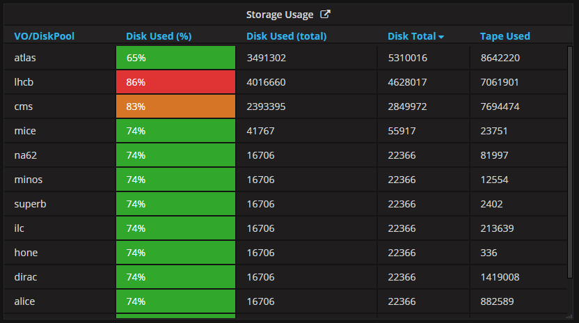
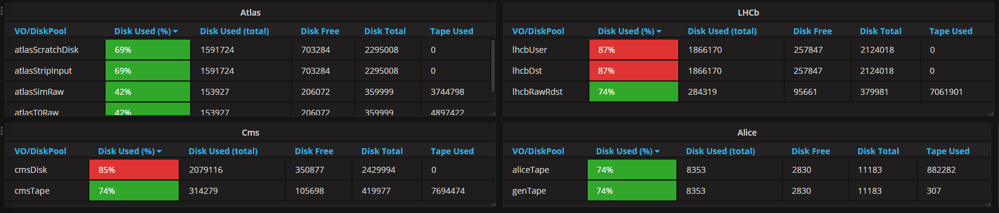

# StatusJsonDatasource
Python scripts to 'jsonize' the gridpp status dashboard feeds for use with Grafana.

## Introduction
The current gridpp dashboard uses php to pull data from different sources (MagDB,
LDAP, EGI) and combine them on every page load. These scripts collect data from
the same sources and convert them in a common format (JSON) that can be accessed
by a Grafana Dashboard when they are served by a webserver.

## Elements

The following elements from the original dashboard have scripts to collect their data into JSON (prefixed with `update`). Some also have setup scripts (prefixed with `setupFolders_`) which create the folders to imitate the JSON api (provide `/query` and `/search` URLs).

Element  | Setup Script | Update Script
-------- | ------------ | ---------------------
Notices  | setupFolders_notices.py | updateNotices.py
Disk Servers in Intervention | setupFolders_diskServersInIntervention.py | updateDiskServersInIntervention.py
Downtimes | setupFolders_downtimes.py | updateDowntimes.py
GGUS | setupFolders_ggusTickets.py | updateGgusTickets.py
Storage Usage | setupFolders_storageUsage.py | updateStorageUsage_VO.py updateStorageUsage_MoreDetails.py
Ganglia (only a proof of concept) | n/a | updateGanglia.py
Pledges | n/a | updatePledges.py
Capacity | n/a | updateCapacity.py

These elements are not included

Element | Why
------- | -----
SAM Test | Not currently working at the time of porting
HTCondor Farm | Data is already in our Grafana instance

## Setup

## Grafana Example
Here, each element is discussed how it is before and after the move to Grafana.

### Notices
#### Before

- 5 most recent notices shown
- 'Click here to add'
- Data from `/var/www/html/status/grid/noticeboard.txt` (these scripts are meant to be run on the same server than provides the noticeboard)

#### Grafana

- All notices shown in paginated table
- Link to add a new one next to the title

### Disk Servers in Intervention
#### Before

- Table showing information about disk servers
- Data from MagDB
- Link through to overwatch

#### Grafana

- Two possible datasources one plain (no links) and one rich HTML (including the links)

### Downtimes
#### Before

- List of downtimes from EGI
- Link through to EGI with the ID
- Hovering over list of machines gives the list of machines
- Severity highlighted for:
    - OUTAGE: red
    - WARNING / AT_RISK: yellow
- Future shown underneath

#### Grafana

- ID links through to EGI
- List of machines shown for ongoing and future down timestamps
- Past downtimes also shown but no list of machines given
- Show in paginated fashion
- Rows highlighted based on 'code' column:
    - Red for current (code = 2)
    - Orange for future (code = 1)
    - Nothing for past (code = "")
- As highlighting is used to differentiate between ongoing and future downtimes, it can't be used for severity

### GGUS
#### Before

- ID Links through to ticket from GGUS
- Row is red if ticket status is 'assigned'
- Data from GGUS

#### Grafana

- ID links through to ticket from GGUS as rich HTML
- Code is 1 if ticket status is 'assigned' (grafana allows a rule to style based on the value of a column)

### Storage Usage (GB)
#### Before

- Link to accounting information
- Data from LDAP
- Clicking on a VO expands into more detail

#### Grafana

- One data source (above) for the overview (with no Disk Free as above)
- Data sources for each of the VOs (below), to show the detailed information.
- Link to accounting information next to storage usage.

### Ganglia Graphs

Many of the ganglia graphs are already in our Grafana instance. Mainly for testing purposes / proof of concept, a ganglia datasource is provided. It takes the json version of the graphs for the standard time periods (1hr, 2hr, 4hr, 1d ... 10y) and combines it into one grafana compatible json time series.

If this were to be taken further, the corrent way to do this would be to pipe the data into InfluxDB. That way, the query would work and only the points for the current grafana view would be sent to the browser. Instead, all the points are sent on each load and grafana refuses to draw the points which aren't in the view (ie those from 10 years ago).
