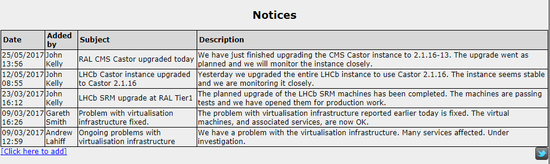
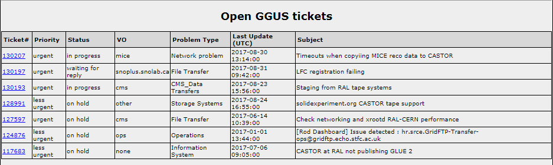

# StatusJsonDatasource
Python scripts to 'jsonize' the gridpp status dashboard feeds for use with
Grafana.

## Introduction
The old gridpp dashboard uses php to pull data from different sources
(MagDB, LDAP, EGI) and combine them on every page load. These scripts collect
data from the same sources and convert them in a common format (JSON) that can
be accessed by a Grafana Dashboard when they are served by a webserver.

## Design + Interaction with Grafana

SCD already has a Grafana instance up and running. It mainly pulls timeseries
data from InfluxDB to plot on various graphs. This project provides a set of
additional datasources (in JSON) for Grafana to use to display data (mainly
text, mainly in tables).

The Grafana JSON datasource is configured to communicate with some URL
(e.g. `some-web-server.stfc.ac.uk/someBasePath/`). It tests connection by
checking that this responds with a `200` return code. It uses `/search` to get
a JSON list of possible timeseries and `/query` with a query string to request
a set of these timeseries between two time intervals.

Our use case is slightly adapting what Grafana is mainly used for. Initially
built to display graphs of timeseries data, it has been expanded to add the
panels and tables which we are using. This project serves a set of information
rather than set of metrics.

It turns out that we want the same content to be displayed regardless of the
query string (which requests time ranges). Although timestamp is sometimes an
element in the table, often, it isn't the factor to choose to show or hide an
event. For example, we want to show all the open GGUS tickets rather than a
list of the GGUS tickets between two time intervals.

We can get away without using an active webserver - which might crash / need to
be maintained - and serve a static JSON response to each datasource. The
staticly served JSON can be updated periodically from the respective
datasources.

### Data Flow

This diagram outlines how the data gets from the initial sources to Grafana.


Section       | Where
------------- | --------
External      | Somewhere on the Internet (STFC or Outside)
Scripts       | The machine with this repository and a webserver installed
Webserver     | The same machine
JSON Enpoints | The same machine
Grafana       | SCD's Grafana Server

### HTML vs non HTML

For some elements (notably Disk Servers In Intervention), both a HTML and non
HTML datasource are provided. In the HTML version, at least one column contains
HTML rather than plain text (allowing clickable links). If you use the HTML
version, you get clickable links but you must inform use a setting in the
Grafana panel to tell it to parse it as HTML.

## Requirements
- `python2.6`
- yum packages: `python-ldap` `PyGreSQL` `python-requests`
- a webserver serving from `/var/www/html` (which is writable by the user
  running the update scripts)

*This should work on python2.6+ but the dependencies (installed using yum) are
built for python2.6. To use a later version of python: instead of using yum, the
pip packages are: pyldap, requests, PyGreSQL*

## Setup for running the Python Scripts

These are the commands to:
1. Install dependencies
2. Setup `secret.py` from [secret_example.py](secret_example.py)
   (this contains sensitive data, not to be uploaded to GitHub)
3. Setup directory structure in `/var/www/html`

*If using the standard setup of yum + SL6 + python2.6, follow the instructions
here. Otherwise see [INSTALL_non_standard.md](INSTALL_non_standard.md).
For either option, also follow commands under the 'instructions for all'
section.*

### Instructions for YUM + SL6 + python2.6
```
# Install yum dependencies.
sudo yum install git python httpd python-ldap PyGreSQL python-requests
```

### Instructions for all
```
# Download the tar from https://github.com/cal-id/StatusJsonDatasource/releases
# Extract the code into /opt
sudo tar -xvf StatusJsonDatasource-<version>.tar -P

# Setup the directory
sudo python setupFolders.py

# Populate secret.py
cp secret_example.py secret.py
# This file is not for github!
# At this stage, put the passwords / details in here
# Gareth Smith has these details.
vi secret.py

# setup cronjobs
45 5 * * * root python /opt/StatusJsonDatasource/updatePledges.py
45 5 * * * root python /opt/StatusJsonDatasource/updateCapacity.py
34 * * * * root python /opt/StatusJsonDatasource/updateStorageUsage_VO.py
34 * * * * root python /opt/StatusJsonDatasource/updateStorageUsage_MoreDetails.py
*/10 * * * * root python /opt/StatusJsonDatasource/updateDiskServersInIntervention.py
*/10 * * * * root python /opt/StatusJsonDatasource/updateDowntimes.py
*/5 * * * * root python /opt/StatusJsonDatasource/updateGgusTickets.py
*/5 * * * * root python /opt/StatusJsonDatasource/updateNotices.py
```

## Setup For Grafana

### Install Grafana

Use [this site](http://docs.grafana.org/installation/rpm/) for the latest instructions. These are instructions for installing Grafana at our current version (v4.0.2).

```bash
# Install repository
sudo cat > /etc/yum.repos.d/grafana.repo << EOF
[grafana]
name=grafana
baseurl=https://packagecloud.io/grafana/stable/el/6/$basearch
repo_gpgcheck=1
enabled=1
gpgcheck=1
gpgkey=https://packagecloud.io/gpg.key https://grafanarel.s3.amazonaws.com/RPM-GPG-KEY-grafana
sslverify=1
sslcacert=/etc/pki/tls/certs/ca-bundle.crt
EOF

# Install Grafana
# See here for why the security flag.
# https://github.com/grafana/grafana/issues/7647
sudo yum install --nogpgcheck grafana-4.0.2  

# Install simple json datasouce for grafana
sudo grafana-cli plugins install grafana-simple-json-datasource

# Start the server and make it run at boot
sudo service grafana-server start
sudo /sbin/chkconfig --add grafana-server
```

## Grafana Example
Here, each element is discussed focusing on how it worked before and after the
move to Grafana.

### Notices
#### Before

- 5 most recent notices shown
- 'Click here to add'
- Data from `www.gridpp.rl.ac.uk`

#### Grafana

- All notices shown in paginated table
- Link to add a new one next to the title

### Disk Servers in Intervention
#### Before

- Table showing information about disk servers
- Data from MagDB
- Link through to overwatch

#### Grafana

- Two possible datasources one plain (no links) and one rich HTML (including
  the links)

### Downtimes
#### Before

- List of downtimes from EGI
- Link through to EGI with the ID
- Hovering over list of machines gives the list of machines
- Severity highlighted for:
    - OUTAGE: red
    - WARNING / AT_RISK: yellow
- Future shown underneath

#### Grafana

- ID links through to EGI
- List of machines shown for ongoing and future down timestamps
- Past downtimes also shown but no list of machines given
- Show in paginated fashion
- Rows highlighted based on 'code' column:
    - Red for current (code = 2)
    - Orange for future (code = 1)
    - Nothing for past (code = "")
- As highlighting is used to differentiate between ongoing and future
  downtimes, it can't be used for severity

### GGUS
#### Before

- ID Links through to ticket from GGUS
- Row is red if ticket status is 'assigned'
- Data from GGUS

#### Grafana

- ID links through to ticket from GGUS as rich HTML
- Code is 1 if ticket status is 'assigned' (Grafana allows a rule to style
  based on the value of a column)

### Storage Usage (GB)
#### Before

- Link to accounting information
- Data from LDAP
- Clicking on a VO expands into more detail

#### Grafana

- One data source (above) for the overview (with no Disk Free as above)
- Data sources for each of the VOs (below), to show the detailed information.
- Link to accounting information next to storage usage.


### Capacity + Pledges
#### Before

- Current REBUS pledged and installed capacities shown
- Link to REBUS in title

#### Grafana

- The JSON provides more that then current data, there is a time series from
  2011
- Single stat planels can be used to show the information on the previous
  dashboard.
- Additionally, the pledges data can be split by experiment or 'SUM only' which
  was on the previous dashboard. Because there is no active server responding
  to the query, SUM only should be used for the single stat (it only returns
  one time series).


## Elements not Included

Element                      | Update Script
---------------------------- | ---------------------
Notices                      | updateNotices.py
Disk Servers in Intervention | updateDiskServersInIntervention.py
Downtimes                    | updateDowntimes.py
GGUS                         | updateGgusTickets.py
Storage Usage                | updateStorageUsage_VO.py updateStorageUsage_MoreDetails.py
Pledges                      | updatePledges.py
Capacity                     | updateCapacity.py

These elements are not included from the old gridpp dashboard

| Element       | Why                                                          |
| ------------- | ------------------------------------------------------------ |
| SAM Test      | Not currently working at the time of porting                 |
| Ganglia       | Data is already in our grafana instance. There was a proof of concept update script which relied on Ganglia returning JSON for its graphs by giving a specific url parameter. However, this no longer happens so it was removed. (see commits up to [185e721]).

[185e721]: https://github.com/cal-id/StatusJsonDatasource/tree/185e72115854973344fb4f49cb2a9f7cbcac652f
