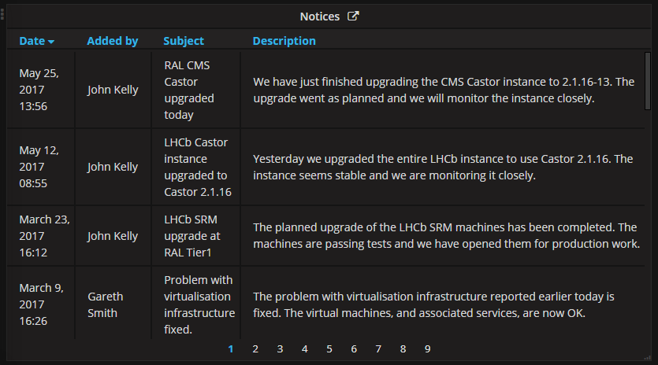
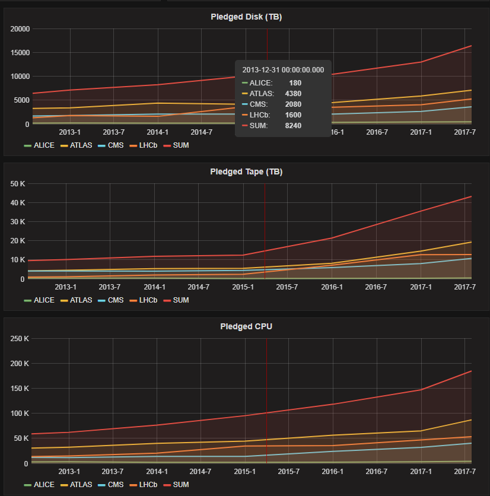

# StatusJsonDatasource
Python scripts to 'jsonize' the gridpp status dashboard feeds for use with Grafana.

## Introduction
The current gridpp dashboard uses php to pull data from different sources (MagDB,
LDAP, EGI) and combine them on every page load. These scripts collect data from
the same sources and convert them in a common format (JSON) that can be accessed
by a Grafana Dashboard when they are served by a webserver.

## Requirements
- python2.6+
- pip requirement in [requirements.txt](requirements.txt)
- a webserver serving from `/var/www/html` (which is writable by the user running the update scripts)

## Setup for running the Python Scripts

These are the commands to:
1. Install OS dependencies (`yum`)
2. Setup `secret.py` from [secret_example.py](secret_example.py)
3. Setup directory structure in `/var/www/html`

See [INSTALL_non_standard.md](INSTALL_non_standard.md) if you don't want to use a
standard SL6 + yum + python2.6 setup (but still follow instructions for all).

### Instructions for YUM + SL6 + python2.6
```
# Install yum dependencies.
sudo yum install git python httpd python-ldap PyGreSQL python-requests
```

### Instructions for all
```
# Allow access to the webserver directory by user running these scripts
# Alternative base directory can be set in config.py
sudo chown $USER /var/www/html/

# Clone the repo
git clone https://github.com/cal-id/StatusJsonDatasource
cd StatusJsonDatasource

# Setup the directory
python setupFolders.py

# Populate secret.py
cp secret_example.py secret.py
# This file is not for github!
vi secret.py  # At this stage, put the passwords / details in here
```

## Elements

The following elements from the original dashboard have scripts to collect their data into JSON (prefixed with `update`).

Element                      | Update Script
---------------------------- | ---------------------
Notices                      | updateNotices.py
Disk Servers in Intervention | updateDiskServersInIntervention.py
Downtimes                    | updateDowntimes.py
GGUS                         | updateGgusTickets.py
Storage Usage                | updateStorageUsage_VO.py updateStorageUsage_MoreDetails.py
Ganglia (proof of concept)   | (Not working) updateGanglia.py
Pledges                      | updatePledges.py
Capacity                     | updateCapacity.py

These elements are not included

Element       | Why
------------- | -----
SAM Test      | Not currently working at the time of porting
HTCondor Farm | Data is already in our Grafana instance


## Grafana Example
Here, each element is discussed how it is before and after the move to Grafana.

### Notices
#### Before

- 5 most recent notices shown
- 'Click here to add'
- Data from `/var/www/html/status/grid/noticeboard.txt` (these scripts are meant to be run on the same server than provides the noticeboard)

#### Grafana

- All notices shown in paginated table
- Link to add a new one next to the title

### Disk Servers in Intervention
#### Before

- Table showing information about disk servers
- Data from MagDB
- Link through to overwatch

#### Grafana

- Two possible datasources one plain (no links) and one rich HTML (including the links)

### Downtimes
#### Before

- List of downtimes from EGI
- Link through to EGI with the ID
- Hovering over list of machines gives the list of machines
- Severity highlighted for:
    - OUTAGE: red
    - WARNING / AT_RISK: yellow
- Future shown underneath

#### Grafana

- ID links through to EGI
- List of machines shown for ongoing and future down timestamps
- Past downtimes also shown but no list of machines given
- Show in paginated fashion
- Rows highlighted based on 'code' column:
    - Red for current (code = 2)
    - Orange for future (code = 1)
    - Nothing for past (code = "")
- As highlighting is used to differentiate between ongoing and future downtimes, it can't be used for severity

### GGUS
#### Before

- ID Links through to ticket from GGUS
- Row is red if ticket status is 'assigned'
- Data from GGUS

#### Grafana

- ID links through to ticket from GGUS as rich HTML
- Code is 1 if ticket status is 'assigned' (grafana allows a rule to style based on the value of a column)

### Storage Usage (GB)
#### Before

- Link to accounting information
- Data from LDAP
- Clicking on a VO expands into more detail

#### Grafana

- One data source (above) for the overview (with no Disk Free as above)
- Data sources for each of the VOs (below), to show the detailed information.
- Link to accounting information next to storage usage.


### Ganglia Graphs

Many of the ganglia graphs are already in our Grafana instance. Mainly for testing purposes / proof of concept, a ganglia datasource is provided. It takes the json version of the graphs for the standard time periods (1hr, 2hr, 4hr, 1d ... 10y) and combines it into one grafana compatible json time series.

However, when tested on 09/08/2017, ganglia no longer returns these datapoints in its JSON. This means that the [updateGanglia.py script](../blob/master/updateGanglia.py) no longer works.

If this were to be taken further, the corrent way to do this would be to pipe the data into InfluxDB. That way, the query would work and only the points for the current grafana view would be sent to the browser. Instead, all the points are sent on each load and grafana refuses to draw the points which aren't in the view (ie those from 10 years ago).

### Capacity + pledgesOverTime
#### Before

- Current REBUS pledged and installed capacities shown
- Link to REBUS in title

#### Grafana

- The JSON provides more that then current data, there is a time series from 2011
- Single stat planels can be used to show the information on the previous dashboard.
- Additionally, the pledges data can be split by experiment or 'SUM only' which was on the previous dashboard. Because there is no active server responding to the query, SUM only should be used for the single stat (it only returns one time series).


